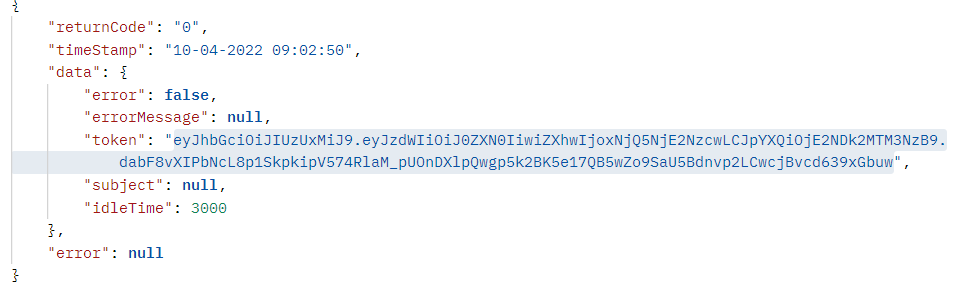

#WAREHOUSE API  GUIDE LINES 
A simple [Spring Boot](http://projects.spring.io/spring-boot/) application
## Requirements

For building and running the application you need:

- [JDK 11](https://www.oracle.com/tr/java/technologies/javase/jdk11-archive-downloads.html)
- [Maven 3](https://maven.apache.org)
- [Mongo DB](https://www.mongodb.com/try/download/community) 
## Running the application locally

There are several ways to run a Spring Boot application on your local machine. One way is to execute the `main` method in the `com.readingisgood.warehouseapi.WareHouseApiApplication` class from your IDE.

Alternatively you can use the [Spring Boot Maven plugin](https://docs.spring.io/spring-boot/docs/current/reference/html/build-tool-plugins-maven-plugin.html) like so:

```shell
mvn spring-boot:run
```

##Controller Description

For Controller usage please run program and check [Swagger](http://localhost:8080/swagger-ui.html) definitions.

# Security

Integration with Spring Security and add other filter for jwt token process.

The secret key is expected from user and  with auth `http://localhost:8080/auth`   controller.
user expected to hold the token value which is in json object like following figure.

⚠️ : keep in mind token valid for 3000 second which can be changed in `application properties` file 
In each request user need to place this token as bearer token in header as authorization filed.


## Copyright

Released under the Apache License 2.0. See the [LICENSE](https://github.com/codecentric/springboot-sample-app/blob/master/LICENSE) file.